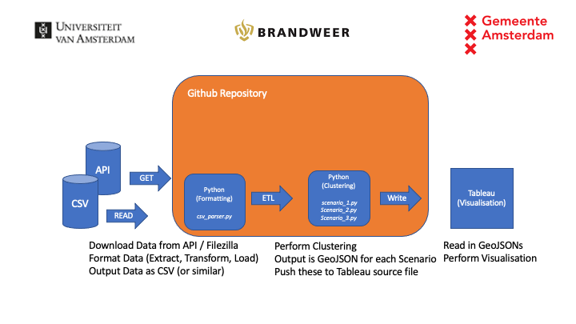
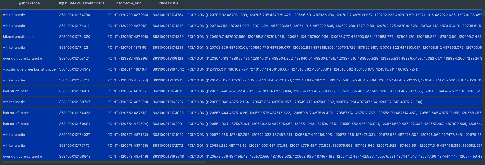

# Data Systems Project Group E1: Fire Risk Profiles

GitHub Repository containing files related to the Data Systems Project E: Fire Risk Profiles of group E1




### Main Logic
##### Necessary Packages

Before running the script, please install the necessary packages. You can do this by typing the following into
the terminal: 
```
$ pip install -r requirements.txt
```


##### Necessary Files
In order to use this script, a number of steps have to be taken. First of all, the necessary CSV files
should be present in the directory of the script. These CSV Files are:
- 'BAG_pand_Actueel.csv'
- 'BAG_verblijfsobject_Actueel.csv'

Both of these files can be downloaded from the Municipality of Amsterdam, using FileZilla. For more 
explanation, please see the [Municipality Website](https://www.amsterdam.nl/stelselpedia/bag-index/producten-bag/). 

#### Reading the CSV Files
In order to use the CSV Files in a Map, they need to be read, formatted and output as a GeoPandas Object. In order to do
so, please run the CSV Parser, contained in the csv_parser.py script. While in the terminal, run the following command:

```
$ python csv_parser.py
```

After reading in the CSV Files, this will create the following output:

- A CSV file (geodata.csv) containing the Panden in Amsterdam which do not have a 'gebruiksdoel' of 'woonfunctie', 
with the following colums:
   - gebruiksdoel
   - ligtIn:BAG.PND.identificatie (Identification used by the Panden CSV File, to connect with a Verblijfsobject)
   - geometrie_vbo (A Point Coordinate, indicating the exact middle of the location of the Verblijfsobject)
   - identificatie (Identification used by the Verblijfsobject)
   - geometrie_pand (A Polygon containing tuples of Coordinates, indicating the circumference of a Pand)


#### Performing Clustering
After creating the two necessary inputs, the different Clustering Algorithms can be used. There are three scenarios 
available, which are discussed in more detail in the report. In order to do this, please run the following commands:


###### Scenario 1
```
$ python scenario_1.py

> Please note that the tool has only been tested with a value for Epsilon of 15, and a value for the minimumamount of VBO's in a Cluster of 5.
> Please provide input for the Epsilon, or press Enter to use a value of 15: 
$ 15
> Please provide input for minimum amount of VBO's in a Cluster, or press Enter to use a value of 5: 
$ 5
```

###### Scenario 2
```
$ python scenario_2.py

> Please note that the tool has only been tested with a value for the minimum amount of VBO's in a Cluster of 5.
> Please provide input for minimum amount of VBO's in a Cluster, or press Enter to use a value of 5: 
$ 5
```

###### Scenario 3
```
$ python scenario_3.py

> Please note that the tool has only been tested with a value for Epsilon of 15, and a value for the minimumamount of VBO's in a Cluster of 5.
> Please provide input for the Epsilon, or press Enter to use a value of 15: 
$ 15
> Please provide input for minimum amount of VBO's in a Cluster, or press Enter to use a value of 5: 
$ 5
```

#### How to use GitHub:

There are a number of free resources available containing instructions on how to use GitHub:

https://guides.github.com/activities/hello-world/

